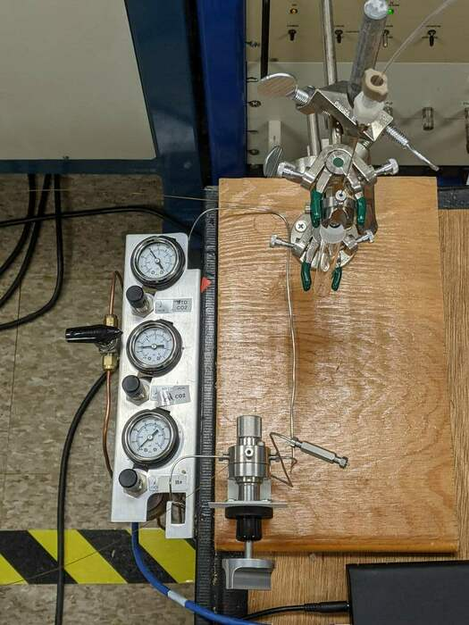
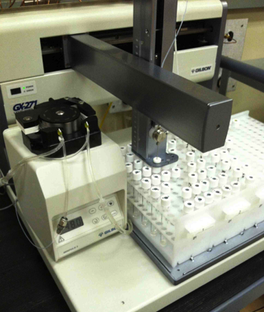

```{r setup, include=FALSE}
knitr::opts_chunk$set(echo = FALSE)
```

# Abstract

We have developed a method for measurement of radiocarbon in carbonate minerals as CO~2~ gas via a NEC MCSNICS hybrid sputter gas ion source (HGIS). The method uses helium as a carrier gas to displace CO~2~ from sample vials to an open split, where a glass capillary samples the mixture for delivery directly to the HGIS. This method skips the gas transfer and quantification steps used in a closed inlet HGIS system, simplifying sample measurement. Samples larger than 10 mg carbonate can currently be measured. Results from measurements of consensus standards (TIRI-I, IAEA C2, and an internal modern shell standard), and samples from a marine core (40-115 pMC) show that the method agrees well with traditional AMS measurement of the same samples as graphite, and that the method error is less than 1.5 pMC. We discuss advantages and disadvantages of continuous flow sample introduction, and the effect of reduced precision on calibrated age-depth models produced using gas-source data.

# Introduction

Radiocarbon Accelerator Mass Spectrometry (AMS) is a sensitive method for determining the age, provenance, and composition of carbon-containing materials. A primary disadvantage of the method is its cost, which often limits the number of samples analyzed. This forces researchers to carefully choose samples to be run and limits repeat measurements for error determination. One driver of the cost of AMS analysis is the time and effort required for sample preparation, including reduction of the sample to graphite. Analysis of analyte CO2 directly via a gas-accepting AMS ion source eliminates the cost and effort of graphitization and returns results more rapidly. The NOSAMS USAMS is an AMS system based on a 3MV Tandetron accelerator. A NEC 134-sample gas-capable MCSNICS source. Analysis of samples as CO2 simplifies sample preparation, making analysis less expensive and faster.

The gas-capable 134-sample MCSNICS from National Electrostatics Corporation (NEC) works on the same principal as hybrid sources developed by ETH (REF) and HVEE (REF). Sample CO2 is introduced onto a titanium frit in an aluminum target using stainless tubing mounted to an arm with a probe that mates with the back of the target. A CO~2~ - helium mixture is exposed to a beam of charged cesium atoms, which causes dissociation of CO~2~ and ionization of molecular and atomic species. Negative ions are extracted from the target and a magnetic filter picks species with masses corresponding to carbon.

Most interfaces to gas-accepting sputter ion sources are a closed inlet design. A mixture of sample and helium is introduced to the source through a capillary, and flow is controlled by the pressure in the sample volume and the length and diameter of the capillary. Flow may be adjusted by changing the pressure by varying the sample volume.

We designed a open inlet where a capillary samples gas for delivery to the ion source in a flowing stream that exhausts to the atmosphere. This defines the delivery pressure as 1 ATM and therefore flow is controlled by the capillary and is not adjustable. The flow of CO2 to the source may be varied by controlling the ratio of CO2 to helium in the sample stream. An open inlet has the advantage of simplicity; flow of CO2 to the source is preset and there are no separate sample transfer and dilution steps. This may translate to greater throughput by eliminating the time required for sample transfer, dilution, and setting of delivery pressure. A disadvantage of the open split is that the flow of CO2 to the source varies with sample size (CO2:He) and changes over the course of a measurement due to dilution of the sample by displacement helium. Our method compensates for this by limiting CO2 flow to a range that produces relatively constant C- ion current and stable ratios. Salazar and Szidat, Roberts gasbench, other open split methods.


# Method

## Inlet description

The open split interface supplies a helium-CO2 mixture to a split where a capillary delivers gas to the source and the rest is vented. A flow of helium is used to displace sample CO2 to the delivery capillary in the split. Our open-split interface is constructed of simple, off-the-shelf parts. The core of the design is a dual needle and split housed in a VICI cross. Displacement helium flows in through one side of the cross, into the sample vial through 1/16" stainless steel tubing, which forms the outer flow path of the concentric dual needle. The mixture of sample CO2 and displacement helium flows up a needle inserted through the cross and stainless tubing which forms the inner flow path of the dual needle. The split is made from a VICI Luer adapter fitted to the outflow of the dual needle with the source delivery capillary inserted (Figure 1). The split has fairly low volume (< 1 mL). Testing is needed to determine minimum sample flow to avoid atmosphere entering the split. TODO: move flow ratio test to results. The system is currently not automated, but may be easily mounted on the arm of a gasbench-style autosampler.

The test setup for extracting CO2 from septa-sealed vials is as follows: a double needle is inserted into the vial through the septa. One side of the needle is connected to helium which is used to force CO2 from the vial through the other side of the needle. The outflow from the vial enters an open split where a capillary is used to admit sample to the ion source. The system is currently set up to run with samples starting at atmospheric pressure.

flow rate from the open split into the source is defined by 250cm of 50um glass capillary (confirm this, SGE, Trajan, Agilent?), split into two sections by a zero-volume bulkhead connector at the source cage. The section inside the cage is jacketed in teflon tubing to help protect against spark damage.




## Sample preparation

Reference: gilson 

Carbonate samples are weighed into 7 ml septa-sealed Vacutainer vials (Labco \# 768W). Sealed vials are evacuated, then 1 ml 85% H3PO4 is added. The samples are allowed to react at 60C for 4-6 h. Sample pressure is adjusted to 1 ATM by adding helium or removing sample using a syringe. Evacuation, acid addition, and heated reaction are performed by the automated gas handling system developed for the CFAMS GIS carbonate system \@ref(Roberts 2013).

Process blank samples are prepared from powdered C-1 or TIRI-F. Standards are prepared using the automated gas handling system by evacuating vials prior to filling with 1 ATM of a modern standard gas.

1.  Weigh 10-30mg Carbonate in septa-sealed 7mL vials produces 2-6mL CO<sub>2</sub> \@ \~1ATM
2.  Evacuate and Acidify with 1 mL H3PO4 using automated Gilson prep bench
3.  After reaction is complete, add helium to bring vials to ambient pressure.



### Measurement

Samples are measured on a modified 3MV Tandetron AMS system \@ref(Longworth 2015). The displacement helium is allowed to flow constantly during analysis, and the sample needle is inserted into a helium-filled vial between samples. Measurement of a sample proceeds as follows: a clean sputter target is inserted into the source and the target is sputtered until ten minutes (check this) have passed or blank target current falls below 100nA. The delivery needle is then inserted into the sample vial, which starts sample delivery to the split and source. Currents take ~30s to stabilize, at which point the data acquisition is started. Data is acquired in 10 blocks of 90 s each, for 15 minutes total acquisition time. Normalizing standards, blanks, and secondary standards are measured in the same way. Total time for a measurement, including target pre-cleaning is 20-25 minutes.

Discuss delivery rates and sample sizes here or in results?

Initial currents of \> 10 uA dropped rapidly, eventually settling to 100-400 nA.
1.  Displace gas to open split with 100 uL/min He.
2.  Introduce mixture to source \@ 30 uL/min

### Data reduction

Normalization to standard, blank correction, and estimation of measurement error are done with the following steps:

1.  Correct for fractionation using online AMS <sup>13</sup>C measurement.
2.  Determine per-sample mean and error (repeatabilty and counting error).
3.  Normalize to mean of Gas standard.
4.  Blank correct: Blank subtraction using mean of carbonate blanks

Errors from normalization and blank correction are propagated at each step. 

Data reduction is done using an R package maintained on github (<https://github.com/blongworth/hgis>).

Normalization and blank correction of measurements

A linear correction using measured values of standard gas and blank samples was used for correction of contaminant carbon and machine blank. We use equation 1 for correction

LBC equation

where x = y.

Constant contaminant discussed below.

Data reduction via R package supplementary materials

# Results

All results in supplementary materials

## System performance

Best currents for the source are around 10uA 12C- or roughly 1/10 of graphite currents. This is in line with what other hybrid sources produce. Typical "good" currents are between 5-10uA. The source typically produces best current at around 5uLs-1 CO2. Literature values give 1.5uLs-1 as optimal, but we've never seen that, and pressures, capillaries and flows in at least one of these papers doesn't make sense.

Source currents are variable by day and by target. "Good" currents for a given day vary between 5-10uA, and it's not yet clear what causes this variability. Alignment, source condition, and settings of the ionizer and cesium are all factors. Current also varies by target for a given set of gas and source conditions. Some targets are clearly "bad", producing currents much lower than other targets for a given set of conditions. Capillary clogging can be an issue, especially when sampling from vials with acid.

Precision taken as the standard error of the mean of repeated runs of a sample is around 1%. Precision is typically a little worse than predicted by counting statistics. More work is needed to look at whether this reflects variability between samples, but initial test of paired replicates show similar standard deviation for samples that show good stable currents.

Measured value of tank modern gas normalized to solid graphite standards ranges from agreeing with solid OX-I to 7% lower than expected for low current samples. Normalizing to tank CO2 is probably the best method to account for variability in hybrid source performance.

Precision of measurements of modern CO2 has been better than 1% (std error of mean of measurements of a target) for high current samples, with precision dropping off as current decreases below 6uA or so. Accuracy is reasonable within the large errors on gas measurements. Uncorrected measurements of dead CO2 range from 1% to 5% of modern depending on sample current.

Measurement of a small number of replicates shows that between sample reproducibility is around 1%. Samples displaced by helium have slightly higher variability, but more tests are needed to better assess reproducibility.

### Currents

Current vs flow modelling

Figure: Current vs flow

### Blanks

#### Current dependent blank


$$I_{sample} + I_{blank} = I_{meas}$$
$$Fm_mI_m=Fm_bI_b+Fm_sI_s$$

$$Fm_s = Fm_m + \frac{I_b(Fm_m-Fm_b)}{I_m-I_b}$$

0.1 μA blank current with 10 μA total = 1% blank
LBC vs constant contaminant/MBC.

Figure: current dependent blank

#### Current independent blank

We decided to use a simple linear correction. Samples kept within a narrow range of current and to a constant size.

If **standards**, **blanks**, and **unknowns** have the **same** blank and current, current drops out.

LBC eqn

$$Fm_s = Fm_m - Fm_{blk}\frac{Fm_{std} - Fm_m}{Fm_{std}}$$

```{r}
# Fix to use current form of processed data
carb_data <- map_dfr(list.files(here("data_analysed"), full.names = TRUE), read_csv) %>% 
  filter(!is.na(rec_num),
         Cur > 2) %>% 
  mutate(fm_diff = mean - fm_consensus,
         fm_sigma = sigma(mean, fm_consensus, merr),
         fmbc_diff = fm_lbc - fm_consensus,
         fmbc_sigma = sigma(fm_lbc, fm_consensus, merr))
```


Mean Fm of blanks: `r carb_data %>% filter(fm_consensus < 0.1 & Cur > 2) %>% pull(mean) %>% mean() %>% format(digits = 3)`

Figure: justification for large blank

Data for blanks

Constant current blank is likely the best model, but we simplify to a large blank correction since blanks vary by run, currents are relatively similar between blanks, unknowns and standards, and the simpler model works well within the error of the method.

### Sample size

Sample size tests.

Figure: sample size vs current vs precision and accuracy

Aimed to fill vial initially

No current degradation down to X. Used Y as optimal mass and backfilled with helium.

First tests of displacing pure CO2 from a vial into the open split using helium are promising. Helium flowing at 100uLm-1 produces current from 7mL of CO2 for over 2 hours. Currents do decrease with time due to dilution, but by supplying higher than optimal CO2 flow to the source initially, stable currents can be maintained for some time. Fraction of CO2 in sample gas should follow this relationship:

$$C(t) = e^{-\frac{r}{V}t}$$

Where $C(t)$ is the fraction CO2, $r$ is the rate of helium displacement flow, and $V$ is the initial volume of the CO2-filled vial.

Setting flow to the source to 10uL/min provides excess CO2 to source until the helium dilution ratio increases to \> 1:1. Another approach may be to backfill vials with helium and run at a higher dilution ratio and flow to the source. This should produce a smaller change in He:CO2 over the course of a run. MICADAS runs at 95% He:CO2, which would mean producing \< 0.5mL CO2 in a 7mL vial and backfilling with helium before displacing to the source. Some intermediate dilution may be appropriate. Alternatively, vials could be flushed with helium prior to acidification, rather than evacuating, leading to some concentration of CO2 in He at slightly \> 1 ATM.

Testing long runs of dilution of CO2 with displacing He and diluting He with CO2 show that the setup is still optimized for low flow to the source, even with larger diameter delivery capillaries. There appears to be a constriction in the split-source tubing that is keeping flows low. Current focus is on the large-sample 7mL method, so this will be diagnosed as time allows.

Targets have shown "pulses" of higher current. Not sure why this is, but I suspect it's either buildup of graphite or other available carbon on the target, or target switching to the "high state" as sometimes happens with solid targets.

First tests with carbonate in vials were hit-or-miss. Problems with capillary clogging and low currents led to poor results for several samples. A pair of NOSAMS2 samples produced good currents, results agreed well, but were about 3% higher than expected Fm. A second set of carbonates produced better currents (\~5uA) and better results. Agreement of replicates varied from 3 to 16 permil. Near-modern NOSAMS2 was very close to the consensus value, while C-2 and C-1 were elevated by 2 and 3.6% respectively, indicating that a blank correction is needed.

Two more recent carbonate tests produced stable currents and backgrounds. Since sample, target blank, and sample blank currents were relatively constant across samples, a large blank correction can be used to correct results. Samples from both runs showed a linear relationship between difference from expected Fm and Fm of the sample, but in one sample set the relationship was positive, and in the other, negative. Since the intercept with 0-offset was close to 0 Fm, I think this is a problem with normalization, rather than blank correction. Standards run at the end of the day are higher than those run at the beginning, which may give clues as to what's going on.

## Reference materials
The per-sample error agrees well with variability of replicates, and measurement of known-value standards shows that the method has no significant bias.

Measured

figure: difference plot

Assessment of data quality.

## Carbonate macrofossils for age-depth model

A suite of carbonate macrofossils consisting of shell and coral fragements from a series of coastal marine cores REF were measured as graphite and as CO2 using the HGIS method.

### Measurements

Table of measurements (supplementary?)

One HGIS sample vial was noted to be at atmospheric pressure when only XX mL CO2 should have been produced. The HGIS measurement for this sample was XX% higher than the measurement as graphite. We suspect that this sample was improperly sealed and eliminated it from the analysis as an outlier. SO2 story?

Figure: bland-altman of HGIS vs graphite.

Summary of agreement

### Age model

Figure: age model comparison graphite HGIS

Age model quality changes with lower precision.

# Discussion

Quantification of method

Cost vs quality discussion

ideas for further development of method

# Conclusion

We developed a method for the analysis of carbonates using an open-split interface to a hybrid sputter gas ion source. This system produces results that agree with graphite measurements to better than 1% from XXX mg of carbonate. Sample preparation takes about 10 min. of person time and 6h of automated processing and reaction time, and 20 min. of measurement time per sample. The simplicity of this approach... With lower cost and time per sample, the lower precision of the method may be balanced by the ability to measure more samples from a population, ie. triplicate measurement or more core depths. This may lead to more accurate results compared to a more precise graphite measurement where reproducibility is not as well constrained.

Sample requirements, analysis time, precision, accuracy.

# Acknowledgements

This work is supported by NSF cooperative agreement. We are grateful to C. McIntyre, R. Hansman, G. Salazar, T. Ognibene, T. Broeck.
