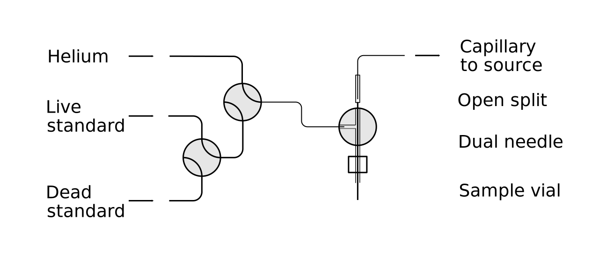

```{r setup, include=FALSE}
knitr::opts_chunk$set(echo = FALSE)
```

```{r, message = FALSE}
library(tidyverse)
library(hgis)
library(here)
#library(errors)

#options(errors.notation = "plus-minus")

carb <- readRDS(here("data_analysed/carb_all.rds")) %>% 
  map_dfr(2)
```

# Abstract

We have developed a method for measuring radiocarbon in carbonate minerals as CO~2~ gas via a NEC MCSNICS hybrid sputter gas ion source (HGIS). The method uses helium as a carrier gas to displace CO~2~ from sample vials to an open split, where a glass capillary samples the mixture for delivery directly to the HGIS. This method skips the gas transfer and quantification steps used in a closed inlet HGIS system, simplifying sample measurement. Samples larger than XXX mg carbonate can be measured. Results from measurements of consensus standards (TIRI-I, IAEA C2, and an internal modern shell standard), and samples from a marine core (F^14^C = 0.4 - 1.15) show that the method agrees well with traditional AMS measurement of the same samples as graphite, and that the method error is less than F^14^C 0.015. We discuss advantages and disadvantages of continuous flow sample introduction, and the effect of reduced precision on calibrated age-depth models produced using gas-source data.

# Introduction

Radiocarbon Accelerator Mass Spectrometry (AMS) is a sensitive method for determining the age, provenance, and composition of carbon-containing materials. A primary disadvantage of the method is its cost, which often limits the number of samples analyzed (REFS?). This forces researchers to carefully choose samples to be run and limits repeat measurements for error determination. One driver of the cost of AMS analysis is the time and effort required for sample preparation, including reduction of the sample to graphite. Analysis of CO~2~ directly via a gas-accepting AMS ion source eliminates the cost and effort of graphitization and returns results more rapidly. The NOSAMS USAMS is an AMS system based on a 3MV Tandetron accelerator combined with a NEC 134-sample gas-capable MCSNICS source [@Longworth2015].

Most interfaces to gas-accepting sputter ion sources are a closed inlet design [@Xu2007; @Uhl2007; @ruff_-line_2010; @Fahrni2013; @wacker_versatile_2013; @gottschalk_radiocarbon_2018]. A mixture of sample and helium is introduced to the source through a capillary, and flow is controlled by the pressure in the inlet volume and the length and diameter of the capillary. Pressure is adjusted by changing either the inlet volume or the amount of gas in the inlet. We designed a open inlet where a capillary samples gas for delivery to the ion source in a flowing stream that exhausts to the atmosphere, often called an open split. This defines the delivery pressure as 1 ATM, and therefore flow is controlled by the capillary parameters and is not easily adjustable during measurement. The flow of CO~2~ to the source may be varied by controlling the ratio of CO~2~ to helium in the sample stream. Changing the ratio of CO~2~ to helium changes the partial pressure of CO~2~ and therefore the carbon flow rate to the source.

An open inlet has the advantage of simplicity; flow of CO~2~ to the source is preset and there are no separate sample transfer and dilution steps. This may translate to greater throughput by eliminating the time required for sample transfer, dilution, and setting of delivery pressure. Reduced system complexity also minimizes points of failure and eases automation and maintenance.

A disadvantage of the open split is that the flow of CO~2~ to the source varies with sample size (CO~2~:He) and changes over the course of a measurement due to dilution of the sample by displacement helium. Our method compensates for this by limiting CO~2~ flow to a range that produces relatively constant C- ion current and stable ratios. In gas-source AMS, Roberts et al. @Roberts2013 use an open split to introduce sample gas to a ECR ion source and Salazar and Szidat @salazar_low-cost_2019 designed a continuous flow system that maintains relatively stable pCO~2~ during acquisition by controlling pressure and venting excess gas to atmosphere.

The gas-capable 134-sample MCSNICS from National Electrostatics Corporation (NEC) [@Xu2007] works on the same principle as hybrid sources developed by ETH Zürich [@ruff_gas_2007; @Ruff2010] and High Voltage Engineering Europa (HVEE) [@BronkRamsey2004]. The sample CO~2~ - helium mixture is introduced onto a titanium insert or frit in an aluminum target cathode using stainless tubing mounted to an arm with a probe that mates with the back of the cathode. Sample gas is exposed to a beam of charged cesium atoms, which causes dissociation of CO~2~ and ionization of molecular and atomic species. Negative ions are extracted from the target and carbon species are selected and interferences filtered by the USAMS Tandetron beamline.

# Method

## Inlet description

The open split interface supplies a helium - CO~2~ mixture to a split where a capillary delivers gas to the source and the rest is vented. A flow of helium is used to displace sample CO~2~ to the delivery capillary in the split. Our open-split interface is constructed of simple, off-the-shelf parts. The core of the design is a dual needle and split housed in a VICI cross. Displacement helium flows in through one side of the cross, into the sample vial through 1/16 in. stainless steel tubing, which forms the outer flow path of the concentric dual needle. The mixture of sample CO~2~ and displacement helium flows up a needle inserted through the cross and stainless tubing which forms the inner flow path of the dual needle. The split is made from a VICI Luer adapter fitted to the outflow of the dual needle with the source delivery capillary inserted (Figure 1). The split has fairly low volume (\< 1 mL). The system was operated manually during development, but may be easily mounted on the arm of a gasbench-style autosampler to enable automated operation.

The test setup for extracting CO~2~ from septa-sealed vials is as follows: a double needle is inserted into the vial through the septa. One side of the needle is connected to helium which is used to force CO~2~ from the vial through the other side of the needle. The outflow from the vial enters an open split where a capillary is used to admit sample to the ion source. The system is set up to run with samples starting at atmospheric pressure.

The helium displacement flow rate was set to 250 μl min^-1^ for initial tests, and this was reduced to 100 μl min^-1^ for later work including most reference standard comparisons and the core comparison. The flow rate from the open split into the source is defined by 250 cm of 50 μm glass capillary (confirm this, SGE, Trajan, Agilent?), split into two sections by a zero-volume bulkhead connector at the source cage. The section inside the cage is jacketed in Teflon tubing to help protect against spark damage. The total flow rate of gas to the source varies due to the viscosity difference between CO~2~ and helium, and is estimated to be 30 μl min^-1^. ???

## Sample preparation

Carbonate samples are weighed into 7 ml septa-sealed Vacutainer vials (Labco \# 768W). Sealed vials are evacuated, then 1 ml 85% phosphoric acid is added. The samples are allowed to react at 60C for 4-6 hours. Sample pressure is adjusted to 1 ATM by allowing the sample to equilibrate with a helium-filled syringe connected through the vial septum. Evacuation, acid addition, and heated reaction are performed by the automated gas handling system developed for the CFAMS GIS carbonate system [@Roberts2013].

Standards are prepared by evacuating vials and then filling with 1 ATM of a modern standard gas using the automated gas handling system. Process blank samples are prepared from powdered C-1 or TIRI-F, acidified in vials using the method above.

## Measurement

Samples are measured on a modified 3MV Tandetron AMS system [@Longworth2015]. The displacement helium is allowed to flow constantly during analysis, and the sample needle is inserted into a helium-filled vial between samples. Measurement of a sample proceeds as follows: a clean sputter target is inserted into the source and the target is sputtered until ten minutes (check this) have passed or blank target current falls below 100 nA. The delivery needle is then inserted into the sample vial, which starts sample delivery to the split and source. Currents take \~30 s to stabilize, at which point the data acquisition is started. Data is acquired in 10 blocks of 90 s each, for 15 minutes total acquisition time. Normalizing standards, blanks, and secondary standards are measured in the same way. Total time for a measurement is 20-25 minutes including target pre-cleaning.

## Data reduction

After aquisition, data reduction, normalization and blank correction result in a final fraction modern with error. First, each 90 s block is corrected for fractionation using the AMS <sup>13</sup>C measurement. The raw ^14/12^C ratio divided by the ^13/12^C ratio squared gives the corrected ^14/12^C ratio. Outlier runs, defined as those outside of 1.5 times the interquartile range, are dropped at this point. Remaining runs of a sample are averaged and per-sample error is taken as the greater of counting error or the standard error of the measurements. Ratios are then normalized using the mean of gas standards measured during the run. The measurement error of the standards is taken as the greater of the standard error of all standards or the errors of the standards added in quadrature.

Measurements are corrected for process and measurement blank using a linear correction that assumes that the corrected fraction modern of blank samples should be zero, samples with the fraction modern of the standard need no correction, and applies a proportional correction to samples of intermediate fraction modern. [@roberts_14c_2019] The correction uses measured values of standard gas and blank samples for correction of contaminant carbon and machine blank. The errors in the blanks and standards are propagated with errors of the samples to produce the final error estimate for the sample. This correction does not account for the effect of a blank with constant mass or current on samples of varying mass or current. For all measurements used to assess the performance of the method and for the Haiti core comparison, sample, standard, and blank masses were kept constant. Sample current did vary, but we believe the linear correction described above produces the most accurate results within this range. We discuss this constant contaminant blank in the results below. Data were reduced using a package written in R [@r_core_team_r_2022] which is published on github (<https://github.com/blongworth/hgis>).

# Results

## Source performance

```{r, message = FALSE}
carbcur <- carb %>%  
  map_dfr(2) %>% 
  compare_consensus() %>% 
  mutate(c12ua = he12C * 1E6)
samples <- read_csv(here("data/carb_data.csv")) %>% 
  select(wheel, pos, mass, he_added)
currents <- left_join(carbcur, samples, by = c("wheel", "pos")) %>% 
  filter(wheel != "USAMS020521")

curmean <- mean(currents$c12ua) %>% format(digits = 2) %>% paste("μA")
cursd <- sd(currents$c12ua)
```

Initial work with the NEC source established optimal source parameters for consistent source performance. We used tank CO~2~ connected through a regulator to the ion source to measure source performance over a range of CO~2~ flows. Best currents for the source are around 10 μA ^12^C^-^, or roughly 1/10 of graphite target current. Best currents were produced at a CO~2~ flow rate of 7.5 μl min^-1^ CO~2~, but the source produces near optimal currents with flows from 7.5-25 μl min^-1^ CO~2~. Adding helium to the gas mixture produced similar currents to pure CO~2~ at the same CO~2~ flow rates. This is generally comparable with other hybrid sources [@Xu2007], although improved target design and continued optimization of source parameters may improve performance [@Salazar2013; @Wacker2013]. Typical currents for this study were between 4-9 μA and average current for all samples was `r curmean`. Several studies have shown best currents at lower CO~2~ flow rates [@Xu2007; @Ruff2010]. While efficiency of the source is best at very low flow rates (\<1.5 μl min^-1^), measuring samples with flow set for optimal current produces more precise results due to higher count rates.

Source currents are variable by day and by target under similar source, inlet, and sample conditions. Factors affecting source current may include capillary condition, source and gas delivery arm alignment, slight variability in target geometry, source condition, and performance of the ionizer and cesium. Current also varies by target for a given set of gas and source conditions. Capillary clogging can be an issue, especially when sampling from vials containing acid.

Precision of measurements of modern CO~2~ has been better than 1% (std error of mean of measurements of a target) for high current samples, with precision dropping off as current decreases below 6 μA or so. Accuracy is reasonable within the large errors on gas measurements. Uncorrected measurements of dead CO~2~ range from 1% to 5% of modern depending on sample current.

### Currents and flows

Current vs flow modelling

Fraction of CO~2~ in sample gas should follow this relationship:

$$C(t) = e^{-\frac{r}{V}t}$$

Where $C(t)$ is the fraction CO~2~, $r$ is the rate of helium displacement flow, and $V$ is the initial volume of the CO~2~-filled vial.

Dilution ratio - 1:1 to 1:3 during analysis

First tests of displacing pure CO~2~ from a vial into the open split using helium are promising. Helium flowing at 100 μl min^-1^ produces current from 7 mL of CO~2~ for over 2 hours. Currents do decrease with time due to dilution, but by supplying higher than optimal CO~2~ flow to the source initially, stable currents can be maintained for some time.

### Sample size

Work with currents and flows (above and Figure 2) predicts that optimal currents should be produced until less than 2 mL CO~2~ (in μg?) remains in the sample vial. Tests of a range of sample sizes support this estimate and show that no reduction in measured current is seen in samples larger than XXX mg C which corresponds to XXX mg CaCO~3~ sample material. To ensure ample sample for optimal measurements, we chose 15 mg as a target sample mass. To ensure that samples started at or slightly above atmospheric pressure, we injected clean helium with a syringe to equilibrate pressure in the vials when the reaction with acid was complete.

## Contaminant carbon

```{r}
# Fix to use current form of processed data
blanks <- carb %>% 
  filter(rec_num %in% c(2138, 83028),
         he12C > 2E-6,
         sample_type == "B")
blankmean <- mean(blanks$norm_ratio) %>% format(digits = 3)
blanksd <-  sd(blanks$norm_ratio) %>% format(digits = 3)

# errors should produce an "all in one" for this, but it doesn't work with inline code
# meanblank <- as.errors(mean(blanks$norm_ratio), sd(blanks$norm_ratio))
nblank <- length(blanks$norm_ratio)
```

### Current dependent blank

The HGIS method produces higher ratios for radiocarbon dead samples than the graphite method. Measurement of radiocarbon-free reference materials shows that the average normalized ratio for these samples is `r blankmean` ± `r blanksd` (N=`r nblank`). We investigated the sources of this method blank as a current-dependent blank and as a current-independent blank.

HGIS cathodes produce measurable ion current, even with no gas flow. This current is initially \> 10 μA and drops exponentially, reaching a baseline of \~100 nA after 5-10 minutes. For the range of currents in this study (3-9 μA), this baseline current represents a 1-6% contribution to the total current at the F^14^C of the target baseline. This can be interpreted as a constant current dependent blank, analogous to a mass-dependent "constant contaminant" blank and may be modeled with the same tools [@haghipour_compound-specific_2019; @hanke_comprehensive_2017; @roberts_14c_2019; @sun_14_2020]. To assess blank contribution and ratio dependence on sample current, vials of live and dead standard gas were measured as the displacement helium flow diluted the samples, producing diminishing current over time. We used these data to develop a current-balance model following methods used to assess mass-dependent or constant contamination blanks in graphite targets (REFS). The constant contamination blank was also assessed directly by measuring pure helium in vials using the same method. Results from both tests are shown in Figure 3a. The inverse of the sample current is used to linearize the data, allowing assessment with a simple linear model [@shah_walter_ultra-small_2015]. Fits from modern and dead dilution tests should trend towards the fraction modern of the blank, crossing at the inverse of blank current. Based on this assessment, we estimate the ratio of the blank as having F^14^C of 0.43 with a current of 110 nA.

The directly measured blank current (120 nA) agrees well with the model assessment, but has a higher fraction modern (F^14^C = 0.82). This is likely due to a combination of low measurement precision for the direct measurement and high sensitivity of the model to variability in the measured fraction modern and current in the depletion samples [@sun_14_2020]. This constant contamination blank is consistent with the fact that hybrid cathodes produce a minimum current with or without gas flow to the source. Given that this minimum current ranges from 100 nA to 400 nA, this current likely makes up a large fraction of the method blank.

$$Fm_s = Fm_m + \frac{I_b(Fm_m-Fm_b)}{I_m-I_b}$$

### Current independent blank

While dilution and direct measurement data show evidence for a constant blank with a variable effect depending on sample size, the blank correction may be simplified if blanks, standards, and unknown samples are the same size [@donahue_isotope-ratio_1990; @roberts_14c_2019]. If the fraction modern of the blank is 0.8 modern as estimated above, radiocarbon-free samples will show the most effect of a constant contamination blank with current. Figure 3B shows the fraction modern of measured blanks compared to their mean ^12^C^-^ ion current. Fraction modern of measured blanks does decrease with increasing current, but the effect is small, less than F^14^C 0.01 over the range of currents measured. This change with current is roughly equal to the variability between blanks, so the error due to the use of a current-dependent blank based on samples measured over multiple wheels will likely be larger than a current independent blank correction based on blanks measured on each wheel. Constant current blank is likely the best model, but we simplify to a large blank correction since blanks vary by run, currents are relatively similar between blanks, unknowns and standards, and the simpler model works well within the error of the method.

We use equation 1 for this correction.

$$ R_{samp} = R_{meas} - \frac{R_{blank}(R_{std}-R_{meas})}{R_{std}} $$

Where $R_{samp}$ is the ratio of the unknown sample, $R_{meas}$ is the measured ratio, $R_{blank}$ is the ratio of the blank, and $R_{std}$ is the ratio of the normalizing standard.

## Reference materials

Precision and accuracy of the method were assessed by measuring carbonate standards with consensus values from graphite measurements. Summary data for these samples are listed in Table 1, and measurement data for all samples is in supplementary information. Measurement, data reduction, and blank correction was performed as described above.

Overall, reference materials run with the hybrid gas method were in good agreement with consensus values. Mean difference from consensus for all measurements was -0.04 pMC, and the standard deviation of the difference was 0.011 F^14^C. Mean propagated measurement error was 0.011 F^14^C for these samples. The hybrid method has no bias in aggregate. Method error is larger than graphite, but calculated per-sample error is similar to standard deviation of replicate measurements. A summary of accuracy and precision of these measurements is in Table 1.

The difference between reference samples and graphite consensus does not vary systematically by fraction modern, indicating that the method has no significant bias by fraction modern (Figure 4).

The per-sample error agrees well with variability of replicates, and measurement of known-value standards shows that the method has no significant bias.

## Carbonate macrofossils for age-depth model

A suite of 15 carbonate macrofossils consisting of shell and coral fragments from a series of coastal marine cores REF were measured as graphite and as CO~2~ using the HGIS method to further test the method and serve to demonstrate a potential application. coral macrofossils from a subtropical coastal marine sediment core using our gas method and compared to the same samples measured using the traditional graphite method.

To further test the method and a potential application, we measured 15 shell and coral macrofossils from a subtropical coastal marine sediment core using our gas method and compared to the same samples measured using the traditional graphite method.

We found the HGIS and graphite measurements to be in good agreement, with no significant bias (Figure 5a). Mean difference between hybrid and graphite measurements was -0.003 F^14^C and the standard deviation of this difference was 0.009 F^14^C. Mean per-sample error was 0.010 F^14^C for HGIS measurements, compared with 0.002 F^14^C for graphite.

One HGIS sample vial was noted to be at atmospheric pressure when the 16 mg sample should have produced only 0.5 atmosphere of CO~2~. The HGIS measurement for this sample was 0.053 F^14^C higher than the measurement as graphite. We suspect that this sample was improperly sealed and eliminated it from the analysis as an outlier.

### Age model

Age models were developed for both the traditional graphite measurements of the core carbonates and the HGIS measurements (Figure 5b). We used the Bchron Baesian radiochronology package [@haslett_simple_2008] to develop these models. The age-depth curves produced by the two datasets are very similar, with the largest differences being in the uncertainty of the individual dates.

Mean and sd of difference of calibrated ages?

The accuracy of age-depth models is often driven by environmental factors and sparse data, rather than the precision of individual dates [@blaauw_double_2018] ONE MORE?. The lower time and cost of the hybrid method allows analysis of more samples. This may produce more accurate age models, despite reduced precision of individual measurements.

Age model quality changes with lower precision.

# Discussion

We developed a method for the analysis of carbonates using an open-split interface to a hybrid sputter gas ion source. This system produces results that agree with graphite measurements to better than 1% from 8-20 mg of carbonate. Sample preparation takes about 10 min. of person time and 6 h of automated processing and reaction time, and 20 min. of measurement time per sample. The simplicity of this approach... With lower cost and time per sample, the lower precision of the method may be balanced by the ability to measure more samples from a population, ie. triplicate measurement or more core depths. This may lead to more accurate results compared to a more precise graphite measurement where reproducibility is not as well constrained.

The accuracy of age-depth models is often driven by environmental factors and sparse data, rather than the precision of individual dates \[3\]. The lower time and cost of the hybrid method allows analysis of more samples. This may produce more accurate age models, despite reduced precision of individual measurements.

Sample requirements, analysis time, precision, accuracy.

ideas for further development of method

# Acknowledgements

This work is supported by NSF cooperative agreement. We are grateful to C. McIntyre, R. Hansman, G. Salazar, T. Ognibene, T. Broek.

# Figures




# Figure captions

Figure 1. Schematic of the open split inlet. Two valco valves provide the ability to admit helium and live or dead tank standards. The double needle is housed in a VICI cross and allows displacement helium to flow into the sample vial and the sample-helium mixture to flow to the open split, where a capillary delivers the mixture to the ion source.

Figure 2. Performance of the NOSAMS MCSNICS hybrid gas ion source. a. Modeled flows of helium and CO~2~ to the ion source during displacement of a pure CO~2~ vial sample with helium. b. Measured 12C- ion current during the same dilution experiment. c. Measured ion current for modeled CO~2~ flow. The stability of the source over a range of flow produces stable current for up to 40 m of measurement time.

Will probably skip this figure: Figure 3. Relationship of sample size to ^12^C^-^ ion current. There is no strong relationship between size and current for samples larger than 800 μg C.

Figure 3. Assessment of blanks. (a) Current dependent blank model and data. F^14^C and current of measurements from dilution tests of live and dead gas are used to generate linear fits which should cross at the F^14^C and current of the constant current blank. Direct determination of F^14^C and current of the blank are also shown. (b) Fraction modern of large, radiocarbon dead samples compared to sample current. Blank rises with decreasing current, as expected, but may be treated as a single blank with a simple correction for full-size samples producing greater than 3 μA ^12^C^-^ current.

Figure 4. Agreement of standards with graphite consensus values. Difference of HGIS measurements from consensus for individual samples are plotted against their expected value. Expected values are spread to avoid overlapping points. Error bars represent one sigma sample errors. The black line is the mean difference from expected value for all measurements, and the blue lines are one standard deviation of all measurements.

Figure 5. Comparison of Haiti core samples measured as graphite and via HGIS. a. Difference between HGIS and graphite measurements of the same materials. Difference between HGIS and graphite measurements is shown on the vertical axis and plotted against the mean of the two measurements. Samples are offset on the horizontal axis for clarity. Error bars are measurement error for each sample. Graphite measurements are included to allow comparison of error estimates. b) comparison of age-depth models produced using HGIS and graphite measurements.

# References
