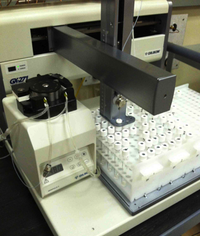

```{r setup, include=FALSE}
options(htmltools.dir.version = FALSE)
knitr::opts_chunk$set(
  fig.width=6, fig.height=3, fig.retina=3,
  out.width = "100%",
  cache = FALSE,
  echo = FALSE,
  message = FALSE, 
  warning = FALSE,
  fig.show = TRUE,
  hiline = TRUE
)
```

```{r}
library(tidyverse)
library(amstools)
library(hgis)
library(here)
library(gt)
library(Bchron)
library(gghighlight)
library(patchwork)
library(scales)
library(latex2exp)
library(errors)

options(digits = 3)
options(scipen = 4)
options(decimals = 4)
options(errors.notation = "plus-minus")
theme_set(theme_classic())
```

Text and figures for AMS-15 poster.

# Abstract

We have developed a method for measurement of radiocarbon in carbonate minerals as CO~2~ gas via a NEC MCSNICS hybrid sputter gas ion source (HGIS). The method uses helium as a carrier gas to displace CO~2~ from sample vials to an open split, where a glass capillary samples the mixture for delivery directly to the HGIS. This method skips the gas transfer and quantification steps used in a closed inlet HGIS system, simplifying sample measurement. Samples larger than 10 mg carbonate can currently be measured. Results from measurements of consensus standards (TIRI-I, IAEA C2, and an internal modern shell standard), and samples from a marine core (40-115 pMC) show that the method agrees well with traditional AMS measurement of the same samples as graphite, and that the method error is less than 1.5 pMC. We discuss advantages and disadvantages of continuous flow sample introduction, and the effect of reduced precision on calibrated age-depth models produced using gas-source data.

# Introduction


# Method


Our method uses an open split and glass capillary to control gas flow to the ion source. Compared to closed inlet systems which regulate introduction of a CO2/Helium mixture to the ion source by regulating sample pressure, our method is simpler and faster, but does not maintain a constant flow of CO2 to the source. We compensate for this by limiting CO2 flow to a range that produces relatively constant C- ion current and stable ratios.


### Sample Preparation

1. Weigh 10-30mg Carbonate in septa-sealed 7mL vials produces 2-6mL CO<sub>2</sub> @ ~1ATM
1. Evacuate and Acidify with 1 mL H3PO4 using automated Gilson prep bench
1. After reaction is complete, add helium to bring vials to ambient pressure.



### Measurement

1. Displace gas to open split with 100 uL/min He.
1. Introduce mixture to source @ 30 uL/min
1. Acquire data: 90s x 10 measurements.

- Normalizing standards: live tank gas in vials
- Blanks: C-1 or TIRI-F in vials


## Data reduction

Normalization to standard, blank correction, and estimation of measurement error are done with the following steps:

1. Correct for fractionation using online AMS <sup>13</sup>C measurement.
1. Determine per-sample mean and error (repeatabilty and counting error).
1. Normalize to mean of Gas standard.
1. Blank correct: Blank subtraction using mean of carbonate blanks

Errors from normalization and blank correction are propagated at each step. The per-sample error agrees well with variability of replicates, and measurement of known-value standards shows that the method has no significant bias.

Data reduction is done using an R package maintained on github (https://github.com/blongworth/hgis).

## Ion currents and method blank

```{r}
# Read data. Don't use first carbonate test, smaller samples, or gas standards.
results_df <- read_csv(here("data_analysed/carb_all_results.csv"))

cons_df <- results_df %>% 
  filter(!(wheel %in% c("USAMS020521", "USAMS061121", "USAMS061821"))) %>% 
  mutate(he12C = he12C * 1E6) %>% 
  compare_consensus() %>% 
  filter(!str_detect(Name, "Gas"))
```

### Ion current vs CO2 flow

Introducing sample through an open split using helium displacement results in a decreasing flow of CO2 to the source over time. Measured ratio can depend on sample current, so CO2 flow rate must be kept in a range where ion currents are relatively constant with changing flow. We evaluated C- current over a range of CO2 flows and found that a range of flows produce a "flat top" in current. Less CO2 will starve the source of available material to dissociate and ionize, and too much CO2 also suppresses ionization.

```{r cur-time-os, fig.height=7, dev='svg'}
data <- process_hgis_results(here("data/USAMS040121R.txt"), as.Date("2021-04-02")) %>% 
  filter(pos == 5) %>% 
  mutate(time = cumsum(corr_lt) / 60,
         co2flow = concCO2(time, r = 244) * 30) #30ul/min

# flow vs time subplot
flow_time <- data.frame(x = 0:125) %>% 
  ggplot(aes(x)) +
  stat_function(fun=function(x) concCO2(x, r = 244) * 30, aes(color = "CO2"), size = 1.5) +
  stat_function(fun=function(x) 30 - (concCO2(x, r = 244) * 30), aes(color = "Helium"), size = 1.5) +
  scale_color_manual("Gas", values = c("#00b7bd", "#b7bf10")) +
  labs(title = "Gas flows to source",
       subtitle = "7mL vial, 244μL/min helium, 30μL/min to source",
       y = "Gas flow (μL/min)") +
  theme_classic() +
  theme(axis.title.x = element_blank(),
        axis.text.x = element_blank(),
        legend.position = c(0.87, 0.65),
        legend.background = element_rect(fill = "white", color = "black")) 

# current vs time subplot
cur_time <- ggplot(data, aes(time, he12C)) +
  geom_smooth(span = .4, se=FALSE, color = "#00b7bd") +
  geom_point(size = 3, color = "#0069b1") +
  xlim(0, 125) +
  labs(title = "Ion current",
       x = "Time (min)",
       y = "12C current (μA)") +
  theme_classic()

flow_time / cur_time
```

```{r cur-flow-os}
ggplot(data, aes(co2flow, he12C)) +
  geom_smooth(span = .3, se=FALSE, color = "#00b7bd") +
  geom_point(size = 2, color = "#0069b1") +
  labs(title = bquote('Ion current is stable for a range of CO'[2]~'flow'),
       subtitle = bquote('Current vs. CO'[2]~'flow during vial dillution'),
       x = bquote('CO'[2]~'Flow (μl/min)'), 
       y = TeX(r'(^{12}C^- current (μA))')) +
  theme_classic()
```


### Blanks and blank correction

Measurements of live and dead gas over a range of C- currents show that there is a current-dependent component to the blank. We believe this is due to a combination of a constant amount of contaminant CO2 and a "target blank" current. This current dependent blank follows the constant contamination model and can be represented with a current balance between the sample and the constant blank. 

While this current-dependent blank is important to consider for samples producing varying ion current, we simplified our assessment of blank by keeping sample currents as constant as possible for blanks, normalizing standards, and unknowns, which allows a simpler correction depending only on the Fm of the blank, standard, and unknown.

This leads to the following model for blank correction:

$$Fm_s = Fm_m - Fm_{blk}\frac{Fm_{std} - Fm_m}{Fm_{std}}$$

Data from the measurement of consensus standards over a range of fraction modern shows that this simple correction is effective for removing blank contribution without bias. Our mean measured fraction modern of C-1 and TIRI-F carbonate blanks is `r cons_df %>% filter(fm_consensus < 0.1 & he12C > 2) %>% pull(norm_ratio) %>% mean() %>% format(digits = 3)`.


```{r blanks}
cons_df %>% 
  filter(fm_consensus < 0.1) %>% 
  ggplot(aes(he12C, norm_ratio)) +
  geom_errorbar(aes(ymin = norm_ratio - sig_norm_ratio, ymax = norm_ratio  + sig_norm_ratio)) +
  geom_errorbarh(aes(xmin = he12C - sig_he12C, xmax = he12C  + sig_he12C)) +
  geom_point(size = 2, color = "#0069b1") + #"#b7bf10"
  #scale_color_manual("wheel", values = c("#b7bf10", "#00a9e0", "#0069b1")) +
  scale_y_continuous(breaks = breaks_extended(7),
                     labels = label_percent(suffix = "",
                                            accuracy = 1)) +
  labs(title = "Contaminant carbon is related to current",
       subtitle = "Fm and current of radiocarbon-free carbonates",
       x = TeX(r'(^{12}C^- current (μA))'),
       y = "pMC") +
  theme_classic() +
  theme(legend.position = c(0.82, 0.76),
        legend.background = element_rect(fill = "white", color = "black")) 
```


## Consensus standards

Replicate measurements of known-value carbonate reference materials were used to establish the precision and accuracy of the method. 

```{r}
cons_df_sum <- cons_df %>% 
  group_by(Name, fm_consensus) %>% 
  summarize(across(c(fm_corr, sig_fm_corr, fm_diff, sigma),
                   list(mean = mean, sd = sd)),
            N = n()) %>% 
  ungroup()

cons_df_sum %>% 
  arrange(fm_consensus) %>% 
  mutate(across(c(fm_consensus, fm_corr_mean, fm_corr_sd, sig_fm_corr_mean), 
         function(x) x * 100),
         fm_corr_err = set_errors(fm_corr_mean, fm_corr_sd)) %>% 
  select(Name, `Consensus` = fm_consensus,
         `HGIS ± SD` = fm_corr_err,
         #`HGIS` = fm_corr_mean,
         #`Std. dev. of measurements` = fm_corr_sd,
         `Mean per-sample error` = sig_fm_corr_mean,
         N) %>% 
gt() %>% 
  tab_header(title = "Reference material precision and accuracy",
             subtitle = "Values in pMC, Errors are SD of measurements") %>% 
  fmt_number(4, 
             decimals = 1) %>% 
  cols_align("right", 3)
```


<br><br>

```{r}
cons_df %>% 
  filter(Name %in% c("TIRI-I", "C-2", "NOSAMS2")) %>% 
  ungroup() %>% 
  summarize(across(c(sig_fm_corr, fm_diff),
                   list(mean = mean, sd = sd)),
            N = n()) %>% 
  select(`Consensus difference` = fm_diff_mean,
         `Std. Dev. of consensus difference` = fm_diff_sd,
         `per-sample error` = sig_fm_corr_mean,
         N
         ) %>%  
  gt() %>% 
  tab_header(title = "Reference material performance summary",
             subtitle = "TIRI-I, C-2, and NOSAMS2. Values in pMC") %>% 
  fmt_number(1:3, 
             scale_by = 100,
             decimals = 2)
```

```{r}
mean_diff <- mean(cons_df$fm_diff)
sd_diff <- sd(cons_df$fm_diff)

cons_df %>% 
ggplot(aes(fm_consensus, fm_diff, color = Name)) + 
  geom_hline(yintercept = 0) +
  geom_hline(yintercept = mean_diff, color = "blue") +
  geom_hline(yintercept = mean_diff + sd_diff, color = "lightblue") +
  geom_hline(yintercept = mean_diff - sd_diff, color = "lightblue") +
  geom_smooth(method = "lm",  se = FALSE) + 
  geom_pointrange(aes(ymin = fm_diff - sig_fm_corr, 
                      ymax = fm_diff + sig_fm_corr), 
                  position = position_dodge2(width = 0.1), 
                  ) + #size = 0.5) + 
   scale_color_brewer(palette = "Dark2") +
  # scale_color_manual(values = c("#00a9e0", "#0069b1", "#00b7bd", "#b7bf10", "#00b7bd")) +
  scale_x_continuous(labels = label_percent(suffix = "")) +
  scale_y_continuous(breaks = breaks_extended(7),
                     labels = label_percent(suffix = "",
                                            accuracy = 1)) +
  labs(title = "Agreement of HGIS with graphite measurements",
       subtitle = "Blank corrected HGIS measurements of consensus carbonate standards",
       x = "pMC expected (points jittered for clarity)", 
       y = "pMC difference (HGIS - expected)")
```


## Marine Sediment Core Carbonates


```{r}
# Read raw and reduced data as produced by analyse_carbonates.R
data <- readRDS(here("data_analysed/carb_all.rds"))

# Read sample data
sample_data <- read_csv(here("data/carb_data.csv"))

# Select relevant reduced data, join with sample data
results <- map_dfr(data, 2) %>% 
  filter(wheel %in% c("USAMS052621", "USAMS062921"),
         pos > 4) %>% 
  left_join(sample_data, by = c("wheel", "pos")) %>% 
  mutate(rec_num = ifelse(is.na(rec_num.y), rec_num.x, rec_num.y)) %>% 
  select(-rec_num.x, -rec_num.y)

names <- results %>% 
  ungroup() %>% 
  filter(wheel == "USAMS062921") %>% 
  select(rec_num, sample_name)

graphite_results <- getRecOS(results$rec_num) %>% 
  filter(!is.na(reported)) %>% 
  select(rec_num, fm_corr = f_modern, sig_fm_corr = f_ext_error) %>% 
  mutate(method = "graphite") %>% 
  left_join(names, by = "rec_num")

combined_results <- results %>% 
  filter(str_starts(sample_name, "HATC") | str_starts(sample_name, "\\d")) %>% 
  mutate(method = "hgis") %>% 
  select(wheel, sample_name, method, rec_num, fm_corr, sig_fm_corr) %>% 
  bind_rows(graphite_results) %>% 
  group_by(rec_num) %>% 
  mutate(fm_mean = mean(fm_corr),
         fm_diff_mean = fm_corr - fm_mean) %>% 
  left_join(rename(names, Name = sample_name), by = "rec_num") %>% 
  left_join(select(graphite_results, rec_num, fm_corr_gr = fm_corr)) %>% 
  mutate(fm_diff = fm_corr - fm_corr_gr) %>% 
  ungroup()

depth <- read_csv(here("data/haiti_depth.csv"))

combined_results <- left_join(combined_results, depth, by = "rec_num") %>% 
  mutate(rc_age = -8033 * log(fm_corr),
         sig_rc_age = rc_age - -8033 * log(fm_corr + sig_fm_corr))

# No outliers
cr_no <- combined_results %>% 
  filter(abs(fm_diff_mean) < 0.02)

mean_diff <- cr_no %>% 
  filter(method == "hgis") %>% 
  summarise(across(fm_diff, list(mean = mean, sd = sd)))

mean_errs <- cr_no %>% 
  group_by(method) %>% 
  summarise(mean_sig = mean(sig_fm_corr)) %>% 
  pivot_wider(names_from = method,
              values_from = mean_sig)
```

To further test the method and a potential application, we measured 15 shell and coral macrofossils from a subtropical coastal marine sediment core using our gas method compared to the same samples measured using the traditional graphite method. We found the measurements to be in good agreement, with no significant bias and errors averaging Fm `r mean_errs$hgis` compared with Fm `r mean_errs$graphite` for graphite measurements.

```{r}
ggplot(cr_no) +
  geom_hline(yintercept = 0) +
  #geom_hline(yintercept = mean_diff$fm_diff_mean, color = "blue") +
  #geom_hline(yintercept = mean_diff$fm_diff_mean + mean_diff$fm_diff_sd, color = "lightblue") +
  #geom_hline(yintercept = mean_diff$fm_diff_mean - mean_diff$fm_diff_sd, color = "lightblue") +
  geom_pointrange(aes(depth, fm_diff, color = method, shape = method,
                      ymin = fm_diff - sig_fm_corr, 
                      ymax = fm_diff + sig_fm_corr),
                  position = "jitter") +
  scale_color_manual(values = c("#00b7bd", "#b7bf10")) +
  scale_y_continuous(breaks = breaks_extended(7),
                     labels = label_percent(suffix = "",
                                            accuracy = 1)) +
  labs(title = "HGIS measurements agree with graphite",
       subtitle = "Sediment core macrofossils measured via HGIS and graphite",
       x = "Core depth (cm)",
       y = "HGIS - graphite (pMC)") +
  theme(legend.position = c(0.80, 0.85),
        legend.direction = "horizontal",
        legend.background = element_rect(fill = "white", color = "black")) 
```


## Fm depth plot

```{r}
combined_results %>% 
  filter(sample_name != "6:7_39-40") %>% 
ggplot(aes(depth, rc_age, color = method, shape = method)) +
  geom_pointrange(aes(ymin = rc_age - sig_rc_age, 
                      ymax = rc_age + sig_rc_age),
                  size = 0.5) +
  geom_smooth(alpha = .2) +
  coord_flip() +
  scale_y_reverse() +
  scale_x_reverse() +
  scale_color_manual(values = c("#00b7bd", "#b7bf10")) +
  labs(title = "HGIS age-depth is similar to graphite",
       subtitle = "Age vs. depth for graphite and HGIS",
       y = "Radiocarbon years (BP)",
       x = "Core depth (cm)") +
  theme(legend.position = c(0.85, 0.30),
        legend.background = element_rect(fill = "white", color = "black")) 
```

## BChron model

```{r}
cal_sub <- combined_results %>% 
  filter(sample_name != "6:7_39-40") %>% 
  filter(!str_starts(sample_name, "HATC")) %>% 
  filter(rc_age > 0) %>% 
  mutate(id = paste(sample_name, "-", method),
         cal_curve = "intcal20") %>% 
  select(id, depth, rc_age, sig_rc_age, cal_curve, method) %>%
  add_row(id = "top-1", depth = 0, rc_age = 0, sig_rc_age = 1, cal_curve = "normal", method = "top")

cal_dates <- with(cal_sub,
  BchronCalibrate(rc_age, sig_rc_age, positions = depth, ids = id, calCurves = cal_curve))

cal_dates_gr <- cal_sub %>% 
  filter(method != "hgis") %>% 
  with(
  BchronCalibrate(rc_age, sig_rc_age, positions = depth, ids = id, calCurves = cal_curve))

cal_dates_gas <- cal_sub %>% 
  filter(method != "graphite") %>%
  with(
  BchronCalibrate(rc_age, sig_rc_age, positions = depth, ids = id, calCurves = cal_curve))

```

```{r, eval=FALSE}
plot(cal_dates)
```

```{r, fig.height=5}
bc_gr <- plot(cal_dates_gr) +
  xlim(8000, 0) +
  ylim(1000, 0) +
  labs(title = "Graphite measurements",
       x = "Age (yBP)",
       y = "Core depth (cm)")
  
bc_gas <- plot(cal_dates_gas) +
  xlim(8000, 0) +
  ylim(1000, 0) +
  labs(title = "HGIS measurements",
       x = "Age (yBP)",
       y = "Core depth (cm)")

bchron <- bc_gr / bc_gas

bchron +
  plot_annotation(title = "HGIS and graphite age models agree",
                  subtitle = "Calibrated ages vs core depth")
```

### Outlier

Sample 6:7_39-40 had an issue during prep. Vial was found to be at ~1 ATM during backfilling with helium. This means the vial had a leaky seal and would have entrained atmosphere (Fm ~0.9) during prep. This is the likely cause of a HGIS Fm 5.2% higher than graphite. This sample was dropped from the comparison. Not sure whether to mention this on poster.


```{r}
combined_results %>% 
  filter(abs(fm_diff) > 0.02) %>% 
  select(sample_name, method, fm_corr, sig_fm_corr, fm_diff)
```