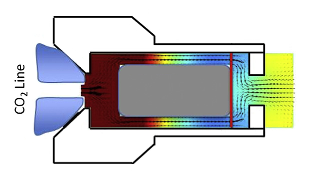
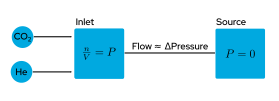
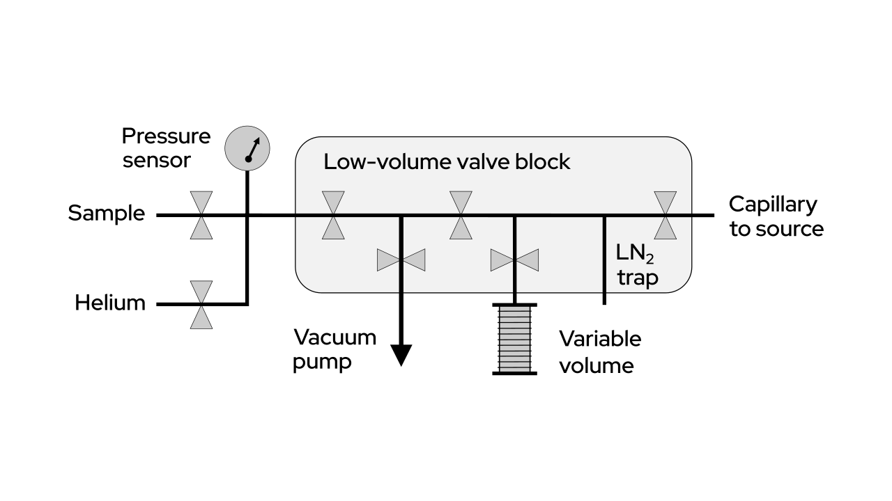
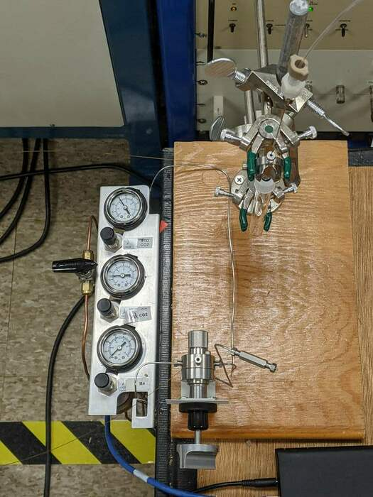

```{r setup, include=FALSE}
options(htmltools.dir.version = FALSE)
knitr::opts_chunk$set(echo = FALSE, message = FALSE, warning = FALSE, fig.showtext = TRUE)

# Libraries
library(tidyverse)
library(xaringanthemer)
library(here)
library(HybridGIS)
library(patchwork)
library(amstools)
library(gt)
library(knitr)
library(broom)

# Colors
dark_blue <- "#041e42"
light_blue <- "#00a9e0"
medium_blue <- "0069b1"
aqua_blue <- "#00b7bd"
cool_gray_11 <- "#53565a"
cool_gray_4 <- "#bbbcbc"
background <- "#e6e7e8"

style_mono_light(
  # colors
  base_color = dark_blue,
  white_color = lighten_color("#d9d9d6", .5),
  # primary_color = background,
  # secondary_color = dark_blue,
  
  # fonts
  header_font_google = google_font("Montserrat", "800"),
  text_font_google = google_font("Red Hat Display", "500")
)
style_extra_css(
  css = list(
    ".title-slide" = list(
      "background-image" = "url(images/whoi_seal_title_bkgnd.jpg)",
      "background-size" = "cover"
    )
  ),
  append = TRUE,
  heading = "Extra CSS"
)

```

# Why run gas instead of graphite?


.pull-left[
### Benefits

- Skip a time-consuming reduction to graphite
- Rapid iteration for science/development
- Eliminate blank associated with graphitization

### Challenges

- Ultimate precision is lower
- Lower currents/counts (time to precision)
- variability in blank (current dependent)
- variability in sample performance
]

.pull-right[

<br>
<br>
```{r method-table}
methods <- tribble(~" ", ~"Graphite", ~"CFAMS ECR GIS", ~"Hybrid GIS",
                   "Continous flow", "No", "Yes", "No",
                   "Measurement time", "30 min", "5 min", "15-30 min",
                   "Precision", "0.3%", "1%", "1%",
                   "Background", "0.1 pmc", "1 pmc", "1 pmc")
methods %>% 
  kable(format = "html",
        caption = "Comparison of AMS methods")

```
]

???

Performance = currents counts stability efficiency time

---

# How do you sputter a gas?


### $$CO_2+e^- \longrightarrow C^-+2O^-$$

<br>
.pull-left[
* Inject CO<sub>2</sub> gas onto Ti target
* Sputter with Cs<sup>+</sup>
* Dissociate molecules
* Produce C<sup>-</sup> ions (and O<sup>-</sup>, CH<sup>-</sup>, OH<sup>-</sup>, CO<sup>-</sup>...)
* Extract C<sup>-</sup> beam
]

.pull-right[

.right[Gas density in HGIS Cathode

(Salazar, 2013)]
]

???

introduction onto Ti surface in target recess

Predicted chemistry/physics of decomposition and ionization

---

# The NEC HGIS

.pull-left[

* Pneumatic arm brings gas to source
* Introduce gas to back of cathode
* The rest is gas handling
<br>
<br>

.center[]
.right[MCSNICS source with gas arm]
]

.pull-right[
.center[

]
]

???

Figure/photo of NEC bellows system

---

# Targets

.pull-left[
Potential for:

* Lower cost
* Better performance
]

.pull-right[

.right[NEC hybrid target cutaway]
]

---

# First tests

.pull-left[
### Conditions
* Pure CO<sub>2</sub> to source
* Modern and dead CO<sub>2</sub>
* 8 m x 50 μm capillary
* 0-4 atm supply pressure

### Results
* ~8 μA <sup>12</sup>C<sup>-</sup>
* <1% precision (SE of repeat measurements)
* 1% blank
* 1-3% total efficiency
]

.pull-right[
```{r cur-flow, fig.height=6, dev='svg'}
read.csv(here("data/14Nov2017LPtest.csv"), skip = 4) %>%
  mutate(flow = flowcalc(supply/10, 2E-5, 1.49E-5, 1.58)) %>% 
  ggplot(aes(flow, current)) +
  geom_smooth(se = FALSE, span = 0.7, color = "#00b7bd") + 
  geom_point(size = 4, color = "#0069b1") +
  labs(title = "Ion current and gas flow",
          x = bquote('CO'[2]~'Flow (μl/min)'), 
          y = "12C current (μA)") +
  theme_classic() +
  theme_xaringan(title_font_size = 20,
                 text_font_size = 16,
                 background_color = "#ffffff")
```
]

---

# Inlet/interface systems

.pull-left[
Adapter between CO<sub>2</sub> producers and source. 

Goal: constant flow of CO<sub>2</sub> to source at ideal rate.

Increase CO<sub>2</sub> flow by increasing pCO<sub>2</sub>:
* Add CO<sub>2</sub> 
* Reduce volume

Gas mixtures - helium dilution:
* Increase pressure and total flow
* Reduce pCO<sub>2</sub>
* CO<sub>2</sub> flow remains constant? No - viscosity
* He is 25% more viscous than CO<sub>2</sub>
]

.pull-right[

### $$PV=nRT$$



### $$Q=\frac{\Delta P \pi R^4}{8\mu L}$$
]

???

Pressure of CO<sub>2</sub> in inlet controls flow in capillary

P = flow = current

1/viscosity = flow

* increase partial pressure of CO<sub>2</sub> by dilution?
Gas inlet controls flow of CO<sub>2</sub> to source by varying pressure, volume, and gas composition.


Dilution with helium

Makes moving small amounts of gas easier by increasing pressure

Source doesn't care about helium as long as it gets its CO<sub>2</sub>


Introduce steady, reproducible current as key to data quality
Constant flow of CO<sub>2</sub> to source produces constant currents, which reduces ratio variability.

---

.pull-left[
# Closed inlet

### Flow control
* Change volume
* Add CO<sub>2</sub>
* Add Helium


### For a given sample size:
* High inlet volume = low inlet pressure (NEC inlet)
* Low inlet volume = high inlet pressure (Ionplus inlet)

<br>
Smallest samples require minimizing inlet volume and pressure while maintaining good flow control
]

.pull-right.center[
<br><br><br>


.right[Dual-bellows closed inlet]
]

???

* Mechanically more complex
* Extra sample transfer time
    * but can be done during burn-in
* Data/performance simpler

---

# NOSAMS Closed inlet

.pull-left[
#### IRMS dual bellows

* VG Prism inlet
* Bellows for volume control
* Cryotraps to move and isolate CO<sub>2</sub>
* LabVIEW control
* Manifold capable


.right[Closed inlet schematic]
]

.pull-right[
```{r dual-bellows-results, fig.height=6, fig.width=7.5, dev='svg'}
data <- get_hgis_data(here("data/USAMS052318RHIGS.txt")) %>% 
                  mutate(Num = ifelse(Pos == 15, "S", "U"))
stdrat <- mean(data$cor1412he[data$Num == "S" & data$outlier == FALSE])
data_523 <- mutate(data, normFm = norm_gas(cor1412he, stdrat))

data <- get_hgis_data(here("data/USAMS053018R.txt"), as.Date("2018-05-30")) %>% 
           mutate(Pos = ifelse(Sample.Name == "OX-II", 6, Pos),
                  Num = ifelse(Pos == 5, "S", "U"))
stdrat <- mean(data$cor1412he[data$Num == "S"])
data_530 <- mutate(data, normFm = norm_gas(cor1412he, stdrat))

data <- get_hgis_data(here("data/USAMS060618R.txt")) %>% 
  filter(Pos != 1,                           #remove spurious pos1 runs
         !(Pos == 3 & X13.12he > 0.011)) %>%     #remove solid OX-I fliers
                  mutate(Num = ifelse(Pos == 5, "S", "U"))
stdrat <- mean(data$cor1412he[data$Num == "S" & data$outlier == FALSE])
data_606 <- mutate(data, normFm = norm_gas(cor1412he, stdrat))

dbd <- rbind(data_523, data_530, data_606)

std <- getStdTable()

dbds <- sum_hgis(dbd) %>% 
  mutate(rec_num = case_when(str_detect(Sample.Name, "Live") ~ 101730,
                             Sample.Name == "OX-I" ~ 34148,
                             Sample.Name == "OX-II" ~ 34149,
                             str_starts(Sample.Name, "C1") ~ 83028)) %>% 
 left_join(select(std, rec_num, fm_consensus), by = "rec_num") %>% 
 mutate(fm_consensus = case_when(rec_num == 101730 ~ 1.0398,
                                 rec_num == 72446 ~ 0.0013,
                                 TRUE ~ fm_consensus),
        fm_diff = mean - fm_consensus)

dbds %>% 
  filter(Cur < 10) %>% 
  ggplot(aes(fm_consensus, fm_diff)) +
  geom_hline(yintercept = 0) +
  geom_pointrange(aes(ymin = fm_diff - merr, ymax = fm_diff + merr),
                 position = position_dodge2(width = .1),
                 size = .6,
                 color = "#0069b1") +
  labs(title = "Closed inlet",
       x = "Expected Fm",
       y = "Fm difference") +
  theme_classic() +
  theme_xaringan(title_font_size = 20,
                 text_font_size = 16,
                 background_color = "#ffffff")
```
]

---

.pull-left[
# Open split

* Pressure is held constant at 1 atm
* Gas mixture controls pCO<sub>2</sub>
* Helium displaces CO<sub>2</sub> from vials into split
* Capillary to source controls gas flow

Open inlets maintain constant atmospheric pressure, producing constant<sup>1</sup> flow to source.


]

.pull-right.center[
<br><br>

.right[Open inlet setup]
]

.footnote[[1] flow varies by composition due to differing viscosity]

???

* Mechanically/operationally simple
* Harder to control current variability
    * during run
    * if sample size differs

---

# Carbonate method

.pull-left[
#### Sample preparation

* Weigh carbonate into vial
* Evacuate vial
* Add acid to carbonate
* Reaction fills vial with CO<sub>2</sub> at 1 atm

#### Measurement

* Pre-sputter target
* Displace sample from vial to split with He 
* Measure ratios for 15-30 min.

]

.pull-right[
.center[]
.right[Automated gas handling system (Roberts, 2013)
]
]

???

table: comparison of carbonate methods
figure: DAG graph of process

---

.pull-left[
# Currents and flows

Helium displacement of CO<sub>2</sub> from vial. Monitor currents and ratios as pCO<sub>2</sub> decreases.

* No current suppression at high pCO<sub>2</sub>
* Current stable until 40 min
* 40 min ≈ 2 mL CO<sub>2</sub>
]

.pull-right[
<br>
<br>
```{r cur-time-os, fig.height=7, dev='svg'}
data <- get_hgis_data(here("data/USAMS040121R.txt"), as.Date("2021-04-02")) %>% 
  filter(Pos == 5) %>% 
  mutate(time = cum_acqtime/60,
         co2flow = concCO2(time, r = 244) * 30) #30ul/min

# flow vs time subplot
flow_time <- data.frame(x = 0:125) %>% 
  ggplot(aes(x)) +
  stat_function(fun=function(x) concCO2(x, r = 244) * 30, aes(color = "CO2"), size = 1.5) +
  stat_function(fun=function(x) 30 - (concCO2(x, r = 244) * 30), aes(color = "Helium"), size = 1.5) +
  scale_color_manual("Gas", values = c("#00b7bd", "#b7bf10")) +
  labs(title = "Gas flows to source",
       subtitle = "7mL vial, 244μL/min helium, 30μL/min to source",
       y = "Gas flow (μL/min)") +
  theme_classic() +
  theme_xaringan(title_font_size = 20,
                 text_font_size = 18,
                 background_color = "#ffffff") +
  theme(axis.title.x = element_blank(),
        axis.text.x = element_blank(),
        legend.position = c(0.87, 0.65),
        legend.background = element_rect(fill = "white", color = "black")) 

# current vs time subplot
cur_time <- ggplot(data, aes(time, he12C)) +
  geom_smooth(span = .4, se=FALSE, color = "#00b7bd") +
  geom_point(size = 3, color = "#0069b1") +
  xlim(0, 125) +
  labs(title = "Ion current",
       x = "Time (min)",
       y = "12C current (μA)") +
  theme_classic() +
  theme_xaringan(title_font_size = 20,
                 text_font_size = 18,
                 background_color = "#ffffff")

flow_time / cur_time
```
]

---

.pull-left[
# Currents and flows

* Note similarity to first tests
* Flat top means stable currents/ratios for long enough to measure
* Sample size can be reduced to 2 mL (~1 mg C)
* Further reduction with increased flow to source

### Balance flow rates to maximize stable currents and minimize sample size
]

.pull-right[
<br>
<br>
<br>
```{r cur-flow-os, fig.height=6, dev='svg'}
ggplot(data, aes(co2flow, he12C)) +
  geom_smooth(span = .3, se=FALSE, color = "#00b7bd") +
  geom_point(size = 3, color = "#0069b1") +
  labs(title = "Vial dilution current",
       subtitle = "250μL/min displacement, 30μl/min delivery",
       x = bquote('CO'[2]~'Flow (μl/min)'), 
       y = "12C current (μA)") +
  theme_classic() +
  theme_xaringan(title_font_size = 20,
                 text_font_size = 16,
                 background_color = "#ffffff")
```
]

???

compare to first tests

Note that our flat-topped current curve allows variable flow of the vial system. MICADAS has a more pronounced peak so this may not work as well. (Check papers for peak shape)

Also note current dependent ratio (blank) as a complicating factor

Lead into blank on next slide

---

```{r cur-blank-data, fig.height = 4, dev='svg'}
data<- get_hgis_data(here("data/USAMS101320R.txt"), as.Date("2020-11-17")) %>% 
  mutate(Num = ifelse(Pos %in% c(2, 4), "S", ifelse(Num == "S", "U", Num)))
stdrat <- mean(data$cor1412he[data$Num == "S" & !data$outlier])
data1013 <- data %>% mutate(normFm = norm_gas(cor1412he, stdrat))

data <- get_hgis_data(here("data/USAMS120320R.txt"), as.Date("2020-12-04")) %>% 
  mutate(Num = ifelse(Pos %in% c(2, 4), "S", ifelse(Num == "S", "U", Num)))
stdrat <- mean(data$cor1412he[data$Num == "S" & !data$outlier])
data1204 <- data %>% mutate(normFm = norm_gas(cor1412he, stdrat))

data1211 <- get_hgis_data(here("data/USAMS120320R.txt")) %>% 
  filter(Pos %in% 1:4 | as.Date(ts) == "2020-12-11")

data <- get_hgis_data(here("data/USAMS120320R.txt"), as.Date("2020-12-18")) %>% 
  filter(Pos != 0) %>% 
  mutate(Num = ifelse(Pos %in% c(2, 4), "S", ifelse(Num == "S", "U", Num)))
stdrat <- mean(data$cor1412he[data$Num == "S" & !data$outlier])
data1218 <- data %>% mutate(normFm = norm_gas(cor1412he, stdrat))

data0108 <- get_hgis_data(here("data/USAMS120320R.txt"), as.Date("2021-01-08"))

data <- get_hgis_data(here("data/USAMS020521R.txt")) %>% 
  mutate(Num = ifelse(Pos %in% c(2, 4), "S", ifelse(Num == "S", "U", Num)))
stdrat <- mean(data$cor1412he[data$Num == "S" & !data$outlier])
data205 <- data %>% mutate(normFm = norm_gas(cor1412he, stdrat))

data <- get_hgis_data(here("data/USAMS030421R.txt"), as.Date("2021-03-05")) %>% 
  mutate(Num = ifelse(Pos %in% c(2, 4), "S", ifelse(Num == "S", "U", Num)))
stdrat <- mean(data$cor1412he[data$Num == "S" & !data$outlier])
data304 <- data %>% mutate(normFm = norm_gas(cor1412he, stdrat))

data <- get_hgis_data(here("data/USAMS040121R.txt"), as.Date("2021-04-09")) %>% 
  mutate(Num = ifelse(Pos %in% c(22, 24), "S", ifelse(Num == "S", "U", Num)))
stdrat <- mean(data$cor1412he[data$Num == "S" & !data$outlier])
data409 <- data %>% mutate(normFm = norm_gas(cor1412he, stdrat))

data <- get_hgis_data(here("data/USAMS041521R.txt"), as.Date("2021-04-16"))  %>% 
  mutate(Num = ifelse(Pos %in% c(22, 24), "S", ifelse(Num == "S", "U", Num)))
stdrat <- mean(data$cor1412he[data$Num == "S" & !data$outlier])
data415 <- data %>% mutate(normFm = norm_gas(cor1412he, stdrat))

std <- getStdTable()

data <- rbind(data1013, data1204, data1211, data1218, data205, data304, data409, data415) %>% 
  mutate(rec_num = case_when(str_detect(Sample.Name, "LiveGas") ~ 101730,
                             str_starts(Sample.Name, "C-1") ~ 83028,
                             str_starts(Sample.Name, "C1") ~ 83028,
                             str_starts(Sample.Name, "TIRI-F") ~ 2138,
                             str_starts(Sample.Name, "TIRI-I") ~ 17185,
                             str_starts(Sample.Name, "C-2") ~ 1082,
                             str_starts(Sample.Name, "C2") ~ 1082,
                             str_starts(Sample.Name, "NOSAMS") ~ 38809,
                             str_detect(Sample.Name, "DeadGas") ~ 72446)) %>% 
 left_join(select(std, rec_num, fm_consensus), by = "rec_num") %>% 
 mutate(fm_consensus = case_when(rec_num == 101730 ~ 1.0398,
                                 rec_num == 72446 ~ 0.0013,
                                 TRUE ~ fm_consensus))

# Summarize by target
ds <- sum_hgis(data) %>% 
  filter((str_detect(Sample.Name, "LiveGas") & Cur > 1) |
         (str_detect(Sample.Name, "DeadGas") & Cur > 1) |
          str_detect(Sample.Name, "Blank")) %>% 
  mutate(Gas = case_when(str_detect(Sample.Name, "LiveGas") ~ "LiveGas",
                         str_detect(Sample.Name, "DeadGas") ~ "DeadGas",
                         TRUE ~ "Blank"),
         Cur_inv = 1/Cur)

# Fit linear model
fits <- ds %>% 
  ungroup() %>% 
  nest(data = -Gas) %>% 
  mutate(fit = map(data, ~lm(mean ~ Cur_inv, data = .x)),
         tidied = map(fit, tidy)) %>% 
  unnest(tidied) 

blankfit <- fits %>% 
  select(Gas, term, estimate) %>% 
  pivot_wider(names_from = c(Gas, term), values_from = estimate) %>% 
  mutate(inv_m_blank = -(`DeadGas_(Intercept)` - `LiveGas_(Intercept)`)/(DeadGas_Cur_inv - LiveGas_Cur_inv),
         Fm_blank = `DeadGas_(Intercept)` + DeadGas_Cur_inv * inv_m_blank,
         m_blank = 1/inv_m_blank) 

# Modeled Fm and mass of blank
blank_val <- blankfit %>% 
  select(Fm_blank, m_blank)
```

.pull-left[

# Current dependent blank

$$I_{sample} + I_{blank} = I_{meas}$$
$$Fm_mI_m=Fm_bI_b+Fm_sI_s$$

$$Fm_s = Fm_m + \frac{I_b(Fm_m-Fm_b)}{I_m-I_b}$$

0.1 μA blank current with 10 μA total = 1% blank

Modeled blank:
* Fm: `r format(blank_val$Fm_blank, digits = 3)`
* Current: `r format(blank_val$m_blank, digits = 3)` μA

Measured blank:
* Fm: `r ds %>% filter(Gas == "Blank") %>% pull(mean) %>% mean() %>% format(digits = 3)`
* Current: `r ds %>% filter(Gas == "Blank") %>% pull(Cur) %>% mean() %>% format(digits = 3)` μA

]

.pull-right[

```{r ratio-cur, fig.height = 4, dev='svg'}
xl <- 8

livefm_cur <- data %>% 
  filter(!(he12C < 2.5 & normFm > 1.05) & fm_consensus > 0.9) %>% 
  ggplot(aes(he12C, normFm)) + 
  geom_point(size = 2, color = "#0069b1") +
  xlim(0, xl) +
  ylim(.8, 1.2) +
  ggtitle("Ratio vs current") +
  theme_classic() +
  theme_xaringan(title_font_size = 20,
                 text_font_size = 18,
                 background_color = "#ffffff") +
  theme(axis.title.x = element_blank(),
        axis.title.y = element_blank(),
        axis.text.x = element_blank())

deadfm_cur <- data %>% 
  filter(fm_consensus < 0.1 & normFm < 0.3 & Sample.Name != "DilDeadGas6") %>% 
  ggplot(aes(he12C, normFm)) + 
  geom_point(size = 2, color = "#00a9e0") +
  xlim(0, xl) +
  ylim(0, .4) +
  xlab("12C Current (μA)") +
  theme_classic() +
  theme_xaringan(title_font_size = 20,
                 text_font_size = 18,
                 background_color = "#ffffff")

(livefm_cur / deadfm_cur) +
  ylab("Fraction modern") +
  theme(axis.title.y = element_text(hjust=-1)) 
```


```{r blank-model, fig.height = 4, dev='svg'}
# Plot of data and model with measured blanks
ggplot(ds, aes(Cur_inv, mean, color = Gas)) +
  geom_abline(slope = blankfit$LiveGas_Cur_inv, 
              intercept = blankfit$`LiveGas_(Intercept)`,
              color = "#0069b1") +
  geom_abline(slope = blankfit$DeadGas_Cur_inv, 
              intercept = blankfit$`DeadGas_(Intercept)`,
              color = "#00a9e0") +
  geom_pointrange(aes(ymin = mean - merr, ymax = mean + merr), size = .3) + 
  scale_color_manual("Gas", values = c("#b7bf10", "#00a9e0", "#0069b1")) +
  xlim(0, 10) +
  labs(title = "Modeled blank",
       subtitle = "Fits cross at Fm and current of blank",
       x = "Inverse 12C Current (μA-1)",
       y = "Fraction modern") +
  theme_classic() +
  theme_xaringan(title_font_size = 20,
                 text_font_size = 16,
                 background_color = "#ffffff") +
  theme(legend.position = "none",
        legend.background = element_rect(fill = "white", color = "black")) 
```
]


???

Blank = Ion current not from sample gas

Targets alone and targets + helium (fm and current)

...but if current is kept constant, current drops out of correction
---

```{r carb-data}
carb_data <- map_dfr(list.files(here("data_analysed"), full.names = TRUE), read_csv) %>% 
  filter(!is.na(rec_num),
         Cur > 2) %>% 
  mutate(fm_diff = mean - fm_consensus,
         fm_sigma = sigma(mean, fm_consensus, merr),
         fmbc_diff = fm_lbc - fm_consensus,
         fmbc_sigma = sigma(fm_lbc, fm_consensus, merr))
```

# Current independent blank

.pull-left[
If **standards**, **blanks**, and **unknowns** have the **same** blank and current:

### Linear fit used to correct:

$$Fm_s = Fm_m - Fm_{blk}\frac{Fm_{std} - Fm_m}{Fm_{std}}$$

### Mean Fm of blanks: `r carb_data %>% filter(fm_consensus < 0.1 & Cur > 2) %>% pull(mean) %>% mean() %>% format(digits = 3)`

]

.pull-right[

```{r blanks, fig.height=5, dev='svg'}
carb_data %>% filter(fm_consensus < 0.1 &
              Cur > 2) %>% 
  ggplot(aes(Cur, mean)) +
  geom_errorbar(aes(ymin = mean - merr, ymax = mean + merr)) +
  geom_errorbarh(aes(xmin = Cur - Cur.sd, xmax = Cur + Cur.sd)) +
  geom_point(aes(color = wheel), size = 3) +
  scale_color_manual("wheel", values = c("#b7bf10", "#00a9e0", "#0069b1")) +
  labs(title = "Blanks",
       x = "12C Current (μA)",
       y = "Fraction modern") +
  theme_classic() +
  theme_xaringan(title_font_size = 20,
                 text_font_size = 16,
                 background_color = "#ffffff") +
  theme(legend.position = c(0.82, 0.76),
        legend.background = element_rect(fill = "white", color = "black")) 
```

]

???

## Current independent correction

Current/target dependent?
Constant blanks and currents allow single mass independent correction

3 ways to control blank
* Reduce blank - better cleaning, presputtering
* Hold standard, blank, unknown current constant and use current independent correction (linear correction based on dead sample Fm)   
* Determine Fm and current of blank and use current dependent correction (current balance model)
Idea: use data from dillution runs of live and dead gas to create curves

It's relatively easy to produce runs with terrible current, but usually not good for blank as caused by other issues.

---


.left-column[
# Secondary standards

* Currents > 2 μA
* Note current dependence

### Data summary
* mean difference: `r format(mean(carb_data$fmbc_diff), digits = 1)`
* sd of difference: `r format(sd(carb_data$fmbc_diff), digits = 2)`

]

.right-column[
.right[
```{r secondaries, fig.height=6, fig.width=7.5, dev='svg'}

ps <- 0.3
dw <- 0.03
yl <- .1

secs <- ggplot(carb_data, aes(fm_consensus, fm_diff, color = Cur)) +
  geom_hline(yintercept = 0) +
  geom_smooth(method = "lm", se = FALSE) +
  geom_pointrange(aes(ymin = fm_diff - merr, ymax = fm_diff + merr), 
                  position = position_dodge2(width = dw),
                  size = ps,) +
  lims(x = c(-0.05, 1.1),
       y = c(-yl, yl)) +
  labs(title = "Difference from expected Fm",
       subtitle = "Uncorrected",
       y = "Fm difference") +
  theme_classic() +
  theme_xaringan(title_font_size = 20,
                 text_font_size = 16,
                 background_color = "#ffffff") +
  theme(axis.title.x = element_blank(),
        axis.text.x = element_blank(),
        legend.direction = "horizontal",
        legend.position = c(.86, 1),
        legend.justification = "bottom")

secs_lbc <- ggplot(carb_data, aes(fm_consensus, fmbc_diff, color = Cur)) +
  geom_hline(yintercept = 0) +
  geom_smooth(method = "lm", se = FALSE) +
  geom_pointrange(aes(ymin = fmbc_diff - merr, ymax = fmbc_diff + merr), 
                  position = position_dodge2(width = dw),
                  size = ps) +
  lims(x = c(-0.05, 1.1),
       y = c(-yl, yl)) +
  labs(subtitle = "Blank corrected",
       x = "Fm expected",
       y = "Fm difference") +
  theme_classic() +
  theme_xaringan(title_font_size = 20,
                 text_font_size = 16,
                 background_color = "#ffffff") +
  theme(legend.position = "None")

secs / secs_lbc
```
]
]

???

precision, accuracy
issues with blank and normalization

---

# MICADAS

.pull-left[
### Coming soon(ish)...

#### Source differences
* one target in source at a time - lower blank
* gas supplied via conical joint in side of target

#### Inlet differences
* MICADAS uses closed inlet
* CO<sub>2</sub> from carbonates transferred onto resin trap in stream of helium
* Sample introduced by adding helium and adjusting flow using variable volume
]

.pull-right[

.right[MICADAS Gas Interface]
]

???

More pronounced current vs. flow curve makes measurement more difficult at variable CO<sub>2</sub> flow.
Salazar and Szidat are developing an open split interface with EA - squish peak with dead volume

photo: micadas source

---

# Summary

NOSAMS has developed a successful method for analyzing radiocarbon in carbonates with an open-split interface delivering CO<sub>2</sub> gas to a NEC MCSNICS gas-accepting cesium sputter ion source.

Current goals:
* Finish characterization of the method
* Compare to graphite with test samples
* Improve accuracy
* Better understand method blank
* Reduce sample size
* Automation of data acquisition and reduction

---

# Thank You!

Mark Roberts, Josh Burton, Josh Hlavenka, Al Gagnon, Kalina Gospodinova, Mark Kurz, and the staff of NOSAMS

Karl von Reden

Cam McIntyre, SUERC

Ted Ognibene, CAMS

<br>
<br>

<table style="width:100%">
<tr>
<td>

</td>
<td>

</td>
<td>

</td>
</tr>
</table>
